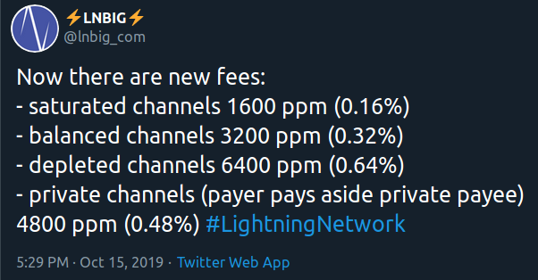

# Create inbound liquidity

Pay with Lightning and receive onchain.

To create inbound liquidity \(to be able to receive payments on a channel you opened\) a payment can be sent to a merchant or exchange accepting Lightning and receive the product or receive the sats back on-chain.

To pay for various gift cards with lightning check out [Bitrefill \(referral link\)](https://www.bitrefill.com/buy/?code=XapbJJd8).

## Non-custodial wallets

Run a separate LN node on your phone or desktop where you can move some funds, so remote balance/ inbound liquidity is created

* [Breez](https://breez.technology/)  

  A mobile wallet which creates a 1 million sats incoming channel automatically, so funds can be moved over in minutes after setting up.  

  Sending the funds out to a bitcoin address on-chain costs 0.5% with [Boltz](https://boltz.exchange/)

* [Zap](https://zap.jackmallers.com/)   

  Run a Lightning Node on Android, iOS or desktop. Channels are managed manually or by the autopilot.

* [Lightning App by Lightning Labs](https://github.com/lightninglabs/lightning-app)  

  An easy-to-use cross platform lightning wallet

  **Custodial wallets**

  Tip yourself via LN and benefit from the inbound liquidity created.

  The drawback is that you don't control the seed of your custodial wallet.  

  Examples:  

* [Tippin.me](https://tippin.me/)
* [Wallet of Satoshi](https://www.walletofsatoshi.com/)
* [Bluewallet](https://bluewallet.io/)

## [Lightning Pool](https://pool.lightning.engineering/)

Buy incoming channels on a permissionless marketplace: [https://pool.lightning.engineering/](https://pool.lightning.engineering/) Usage notes: [pool.md](pool.md)

## [Lightning Loop](https://github.com/lightninglabs/loop)

Lightning Loop is a non-custodial service offered by Lightning Labs to bridge on-chain and off-chain Bitcoin using submarine swaps.

In the current iteration of the Loop software, two swap types are supported:

* Loop Out: off-chain to on-chain. The Loop client sends funds paid on Lightning to a Bitcoin address.
* Loop In: on-chain to off-chain. The Loop client sends funds paid on-chain to a Lightning channel.
* Max swap amount: 4 200 000 sats
* Example usage for lowest cost \(leads to longer confirmation time \(estimation for 25 blocks\) and higher failure rate \(max routing fee 500 sats\) - adjust the numbers accordingly\):  
  `loop out --conf_target 25 --max_swap_routing_fee 500 4200000 [optional external address]`

  ```text
     loop out [command options] amt [addr]

    # --channel value               the 8-byte compact channel ID of the channel to loop out (default: 0)
    # --addr value                  the optional address that the looped out funds should be sent to, if let blank the funds will go to lnd's wallet
    # --amt value                   the amount in satoshis to loop out (default: 0)
    # --conf_target value           the number of blocks from the swap initiation height that the on-chain HTLC should be swept within (default: 6)
    # --max_swap_routing_fee value  the max off-chain swap routing fee in satoshis, if let blank a default max fee will be used (default: 0)
    # --fast                        Indicate you want to swap immediately, paying potentially a higher fee. If not set the swap server might choose to wait up to 30 minutes before publishing the swap HTLC on-chain, to save on chain fees. Not setting this flag might result in a lower swap fee.
  ```

  [https://lightning.engineering/loopapi](https://lightning.engineering/loopapi)

## [ChainMarket](https://chainmarket.etleneum.com/)

A Lightning to onchain swap market with batched transactions. Fee: 0.5%

## [Sats4Likes](https://kriptode.com/satsforlikes/index.html)

Post an advert and pay satoshis for incoming channels.

## [Boltz](https://boltz.exchange/)

Fee: 0.5% both ways

## [Bitfinex](https://bitfinex.com)

A non-KYC \(if not used for fiat\) exchange supporting Lightning deposits \(free\) and withdrawals \(100 sats\). Withdrawal onchain costs a fixed 40000 sats. Find it's nodes at [https://ln.bitfinex.com/](https://ln.bitfinex.com/)

## [FixedFloat](https://fixedfloat.com/)

Lightning cryptocurrency exchange Fee: 0.5 - 1% both ways

## [ZigZag.io](https://zigzag.io/#/)

An exchange that accepts Lightning payments. Max 4M sats Commission ~ 2%

## [LightningTo.me](https://lightningto.me/)

Opens a channel for free funded with 2 000 000 satoshis. Need to have 10 channels open already to use this service.  
Add their node as a peer if connecting from behind Tor:  
`$ lncli connect 03bb88ccc444534da7b5b64b4f7b15e1eccb18e102db0e400d4b9cfe93763aa26d@138.68.14.104:9735`

## [LightningPowerUsers.com](https://lightningpowerusers.com/home/)

Request inbound capacity for a small fee Recommended channel size: Between 500 000 and 16 500 000 satoshis.

## [Thor: Lightning Channel-Opening Service by Bitrefill.com](https://www.bitrefill.com/thor-lightning-network-channels/?hl=en)

Pay with Lightning for an inbound channel of up to 16 000 000 satoshis.

## [LNBIG.com](https://lnbig.com/#/open-channel)

Free incoming channel with up to 5 000 000 sats from [https://twitter.com/lnbig\_com](https://twitter.com/lnbig_com)

Once there is higher balance on the side of your node an other incoming channel can be requested.

the service is paid in routing fees:



## [github.com/bitcoin-software/ln-liquidity](https://github.com/bitcoin-software/ln-liquidity)

List of exchange services to make coin swaps LN &lt;-&gt; onchain & more

