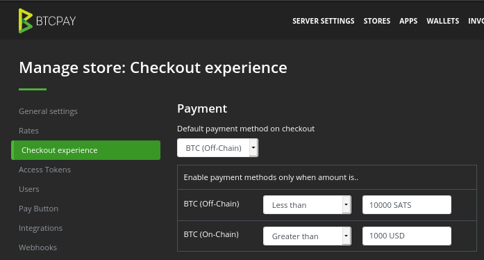

# Merchant
Aimed for receiving payments, focuses on inbound liqudity

## Capital requirement
* minimal to buy incoming channels
* temporarily high to create incoming capacity from channels opened

## Channels and peers
* few \(2-3\) channels with well connected and capitalized nodes
* connect to nodes on the [Bos list](../advanced-tools/bosscore.md)
* see existing fee settings on [Amboss](https://amboss.space/) / [1ml.com](https://1ml.com/)
* Check node stability on [Lightning Web](https://terminal.lightning.engineering)

## Liquidity
* mostly remote

## Uptime
* high, but not perfect
* unavailability affects sales

## Management
* [Loop out](https://github.com/lightninglabs/loop#lightning-loop) \([Autoloop](https://docs.lightning.engineering/advanced-best-practices/advanced-best-practices-overview/autoloop)\) to empty existing channels
* Close and Reopen when channels are filled up
  * a channel open \(and close\) is not more expensive than using Loop given :
    * have onchain liquidity for more channels \(or splice in in the future\) or
    * can afford the channel downtime between peers to close and reopen
* Buy further [inbound liquidity](../createinboundliquidity.md)
* Use liquidity ads to buy inbound
* Try Amboss Magma
* Place bids on [Lightning Pool](../advanced-tools/pool.md)
* Advertise to receive inbound
* [Sweeping funds](https://github.com/lnbook/lnbook/blob/develop/05_node_operations.asciidoc#sweeping-funds)
  * On-chain or off-chain sweeps may be necessary if Lightning wallet balance becomes too large
  * An off-chain sweep can improve your privacy as well as give you inbound liquidity

## Examples
* [Self hosted node](https://github.com/bavarianledger/bitcoin-nodes) connected to a local or remote BTCPayServer
* BTCPayServer on a VPS \(acceptable with low amount of funds\)
* Fully hosted solutions \(trusted\) - eg. Voltage
* Coming: Greenlight from Blockstream

## Special cases
* Accepting [donations](../donate/donations.md)
* Offer to pay onchain for high value payments \(miner fee &lt; 0.5-1%\)

  

* can progress to a [Routing node]() as the number of connections and capital grows

